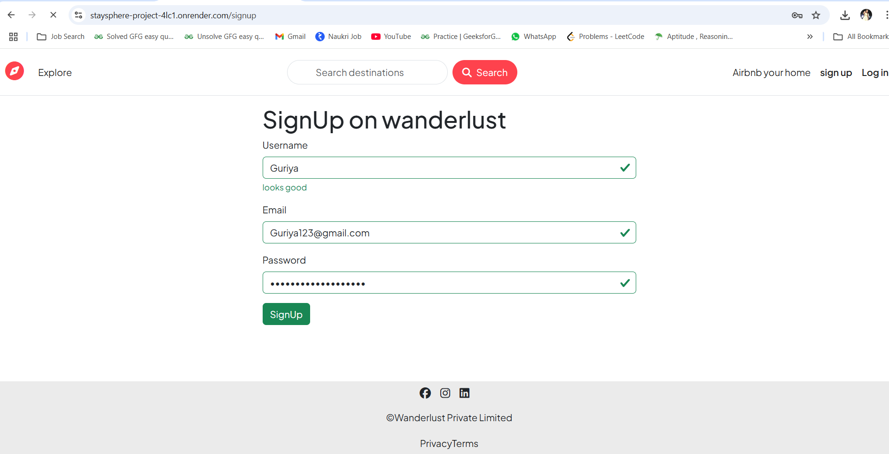
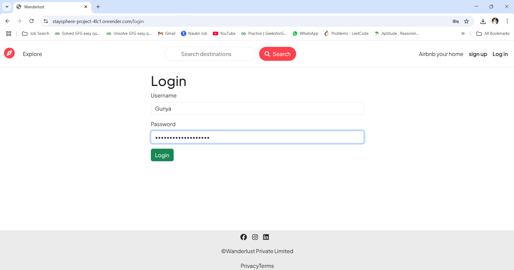
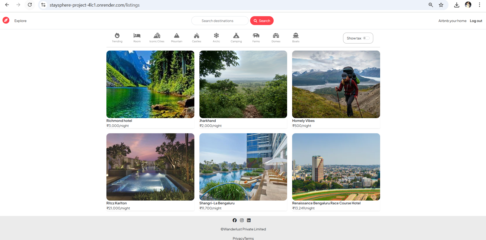
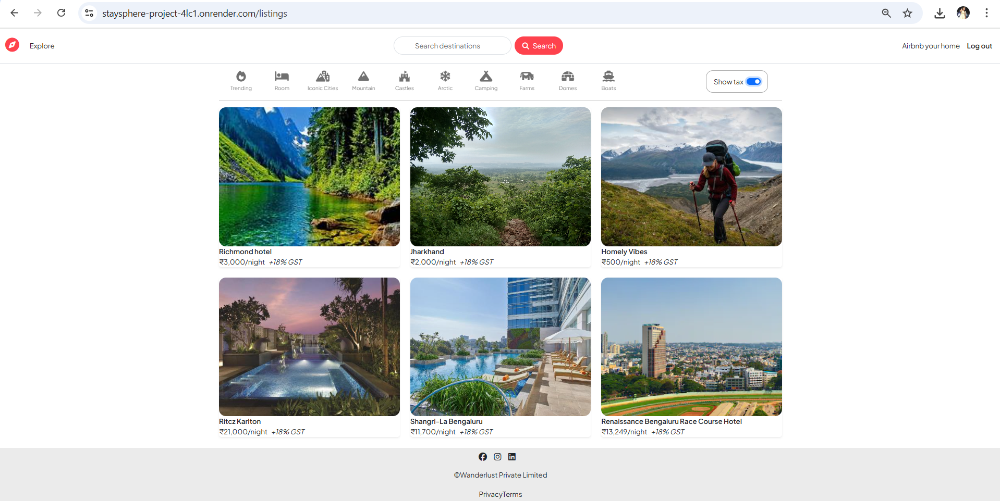
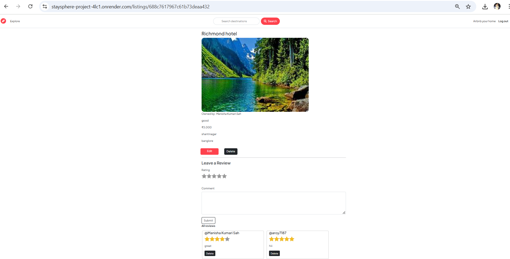
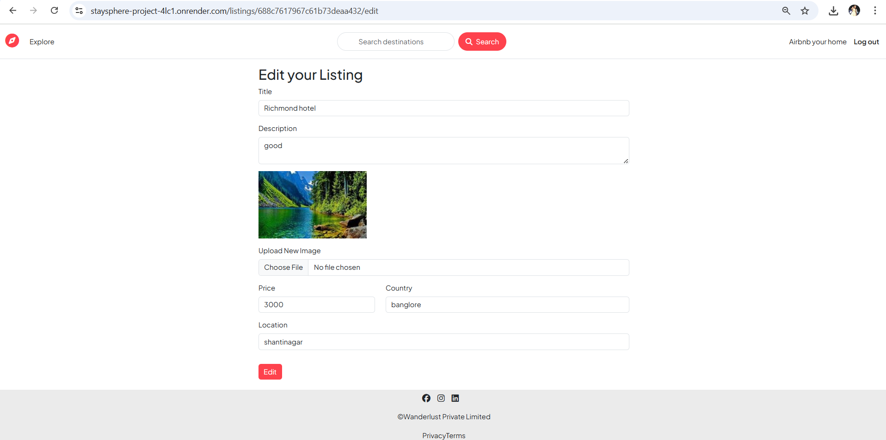
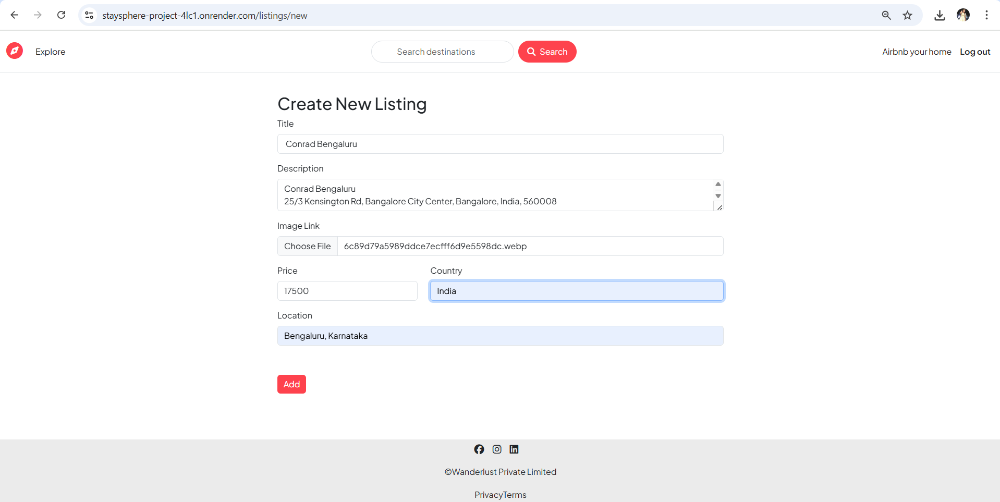

# StaySphere 🏨

StaySphere is a full-stack hotel booking platform that allows users to explore available hotel listings, create their own listings, and manage bookings. It provides user authentication and supports admin-level listing management.

## 🌐 Live Demo

👉 [Visit StaySphere](https://staysphere-project-4lc1.onrender.com)

## ✨ Features

- 🏨 View hotel/property listings with images, title, price, and location
- 🧑‍💼 User authentication (Sign up, Log in, Logout)
- ➕ Add new listings (for logged-in users)
- ✏️ Edit and delete your own listings
- 🛡️ Basic authorization to restrict listing modification to the listing owner
- 📱 Fully responsive design using Bootstrap

## 📸 Screenshots

> SIGN UP

> SIGN IN


> All the Hotels (Explore Page)
> 
> Show Amount + GST %
> 
> Give Rating to hotel with Comments (also check others rating)
> 
> Edit the Hotel Details
> 
> Create New Listings of Hotel
> 


## 🛠️ Tech Stack

### Frontend:
- EJS Templates
- HTML5, CSS3, Bootstrap 5

### Backend:
- Node.js
- Express.js

### Database:
- MongoDB
- Mongoose ODM

### Other Packages:
- express-session
- connect-mongo
- method-override
- dotenv
- multer (for image uploads)
- cloudinary (for image storage)

### Deployment:
- Render (Full-stack app hosted on Render)

## 🚀 Getting Started Locally

### Clone and install dependencies
```bash
git clone https://github.com/your-username/staysphere.git
cd staysphere
npm install
